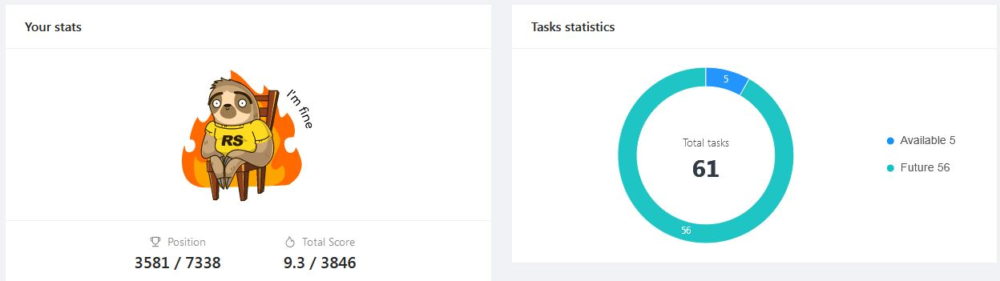

###### ___MY FIRST CV ON MARKDOWN___
---


##Gennady Glukhov
###Engineer
---

####Contact information:

* **Phone:** +7 777 7777777
* **E-mail:** 778855@mail.com
* **Telegram:** @Genv

---
####About Me:   
I work as an engineer in an aviation center. Automating the production routine. I want to make the current software cross-platform. My goal is to gain knowledge of front-end and back-end development.
> This will make it possible to simplify the maintenance and revision of the current software
---
####My strengths:
* Computer literacy
* Stress resistance and adaptability
* Task delegation
* Critical thinking
* Ability to motivate
---
####I want to improve my skills 
* HTML 5
* CSS (SASS/SCSS, BEM)
* JavaScript
* GoLang
* Phyton
* Git/GitHub
---
####Simple code
```
const eurosCount = 1000;
let euroDollarExchange = 1.06;
let dollarRubleExchange =  75.9;
console.log(`€${eurosCount} will be \$${eurosCount * euroDollarExchange}\nor \₽${eurosCount * euroDollarExchange * dollarRubleExchange}`);
```
####Courses:
So far has just begun to study at [RS School](https://rs.school/)



---
####Langueges
* **Español** ___A1___
* **English** ___Beginner___